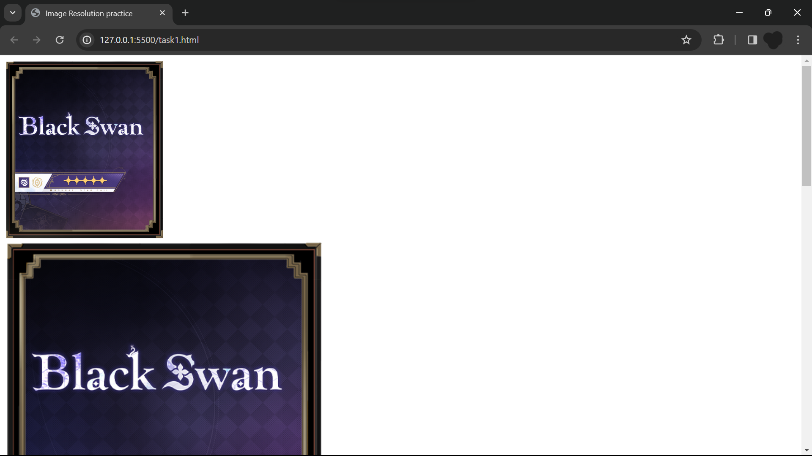
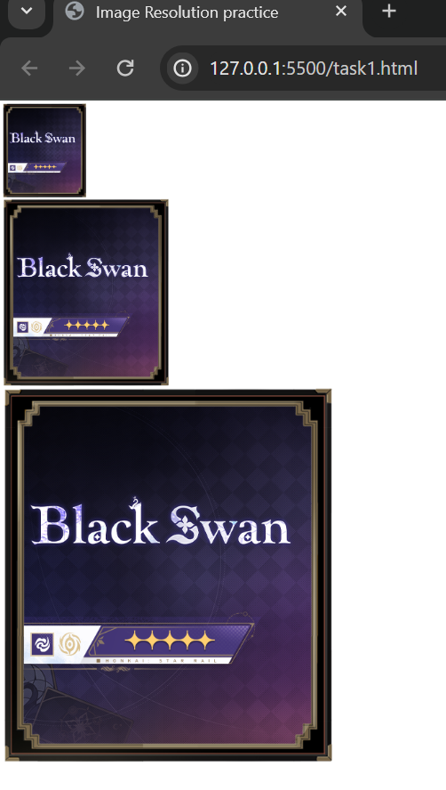

# CSS_Crafts

Hello everyone, This git repo is about sharping your thoughts on CSS.

for better working, I Like to suggest using live sever and material icon theme. 

# Task-1
task-1 is about using the basic style height and wdith.

The process to understand them is by checking the resolution of image like 2x,3x (or) /2,/3.

By checking the resolution in different method can improve the developer thinking power.

As you can think why it is need. While coming to cerating a webpage,the images may have resolution more than required.

So,by practicing it is the best chioce.

* NOTE : The CCS is taken as inline for this task

here is the output in the webpage
this is in normal zoom.

& and this one is at 25% zoom.

And This is the ending for task-1

# Task-2

it is divided into two tasks.

task2_1 is about the types of stylings and task2_2 is about types of selectors in css.
